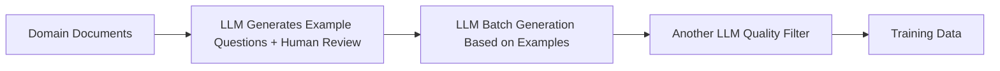
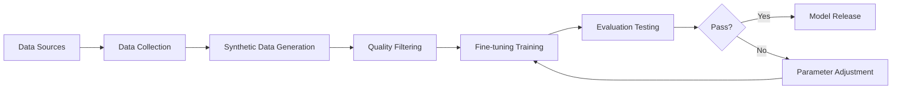

# Domain Model Fine-tuning: From General LLM to Domain Expert

The same model can perform very differently depending on the scenario.

GPT, Claude, Qwen—these general-purpose models excel at everyday tasks: drafting emails, translating documents, summarizing articles. But put them in specialized domains—technical terminology, domain-specific reasoning—and they start to struggle.

It's not a capability gap. It's a knowledge gap. Specialized knowledge isn't in the public training data, so models have nothing to learn from.

Fine-tuning bridges that gap.

## 1. Why Fine-tuning?

A common question comes up: RAG is mature now. Can't we just store domain knowledge in a vector database and use retrieval + generation?

The answer: **RAG solves the "knowledge problem", fine-tuning solves the "capability problem"**. They're different things.

### Limitations of RAG

RAG essentially gives the model an "external knowledge base". The model doesn't internalize new knowledge—it just gains the ability to look things up.

This creates three core issues:

**1. Insufficient Reasoning**

When a question requires multi-step reasoning—"Based on Clause A and Clause B, derive Conclusion C"—RAG can retrieve A and B. But the model may still fail to reason correctly because it doesn't truly understand the logical relationship between them.

**2. Shallow Terminology Understanding**

Professional terminology often differs between "literal meaning" and "actual usage". In finance, for example, "position" means something quite different in practice than its literal definition. RAG can retrieve explanations, but the model may still misuse terms in practice.

**3. Unstable Output Format**

Business scenarios typically require stable, structured output. RAG can provide format examples, but the model won't necessarily follow them consistently.

### Value of Fine-tuning

Fine-tuning enables the model to truly internalize domain knowledge, not just "look things up":

- **Terminology Understanding**: The model learns correct usage of professional terms
- **Reasoning Capability**: The model masters domain-specific reasoning patterns
- **Output Stability**: The model produces consistent output formats

Of course, fine-tuning has costs: data, compute, and time. Not every scenario requires it.

Rule of thumb: **If RAG + Prompt Engineering solves your problem, stick with the lightweight approach**.

## 2. Data Preparation: Synthetic Data in Practice

Fine-tuning needs data—high-quality domain data.

The question is: where does it come from?

The client didn't have a ready-made Q\&A dataset. Public datasets were either too generic or of questionable quality. Manual annotation? Too expensive, too slow.

Our solution: **have the LLM generate its own training data**.

### Data Generation Pipeline

We collected a large amount of industry-related books, web pages, and professional documents, then generated Q&A pairs through LLMs:



Specific steps:

**1. Example Question Generation and Review**

Have the LLM generate several example questions for each chapter. Human reviewers ensure diverse question types, accurate phrasing, and appropriate difficulty. These examples serve as "seeds" to guide subsequent batch generation.

**2. Batch Generation**

Based on approved example questions, have the LLM generate more similar questions for each chapter. Example questions serve as "few-shot" prompts, guiding the model to produce questions that meet expectations.

**3. Quality Filtering**

Use another LLM to evaluate generated questions and filter out low-scoring samples. This automates most of the quality control work.

### Key Points in Data Quality Control

The core challenge with synthetic data: **How do you verify that generated content is correct?**

In practice, we found several key points:

- **Example question quality sets the ceiling**: If example questions have bias, batch generation will amplify it
- **Diversity requires intentional design**: Question types, difficulty levels, and phrasing styles all need coverage to avoid model "tunnel vision"
- **Fact-checking still needs humans**: Content involving specific numbers and dates is prone to LLM errors and requires human sampling

### Test Set and Evaluation Dimensions

Besides training data, we also need a **test set** to evaluate model performance.

Test set construction follows a similar process, with two differences:

- Smaller volume (about 10% of training set)
- Covers all evaluation dimensions to ensure comprehensive testing

Evaluation dimensions include:

- **Terminology Understanding**: Correct explanation and application of professional terms
- **Reasoning Capability**: Performance on multi-step reasoning tasks
- **Application Scenarios**: Problem-solving in actual business contexts
- **Output Format**: Stability of structured output

## 3. Fine-tuning Method: QLoRA in Practice

We chose **QLoRA (Quantized Low-Rank Adaptation)** over full fine-tuning.

### Why QLoRA

Full fine-tuning requires retraining all model parameters—extremely costly in terms of data, compute, and the risk of "catastrophic forgetting" (the model forgets old knowledge while learning new).

QLoRA adds quantization on top of LoRA, further reducing memory requirements. The approach: **freeze original model parameters, only train low-rank adaptation matrices, while quantizing the original model to 4-bit**.

Advantages:

- Extremely low memory footprint—runs on consumer-grade GPUs
- Fast training
- Can save multiple adapters and switch as needed
- Less prone to forgetting general knowledge

Limitations:

- Limited ability to learn entirely new knowledge—better suited for "reinforcing existing knowledge"

### Which Layers to Train?

QLoRA allows you to choose which layers to train. Common choices:

**1. Only Attention Layers (q\_proj, v\_proj)**

The lightest option. Smallest parameter count, fastest training. Limited effectiveness improvement—best for scenarios with small knowledge increments.

**2. All Attention Layers (q\_proj, k\_proj, v\_proj, o\_proj)**

A balanced choice. Covers the complete attention mechanism with better results at moderate parameter count.

**3. Both Attention and FFN Layers**

The most effective option. FFN layers (gate\_proj, up\_proj, down\_proj) handle knowledge storage and transformation. Training these layers injects domain knowledge more deeply. The tradeoff: larger parameter count and longer training time.

Our choice: **Train all Attention layers and FFN layers** for optimal results.

```python
from peft import LoraConfig

lora_config = LoraConfig(
    r=64,
    lora_alpha=16,
    target_modules=[
        "q_proj", "k_proj", "v_proj", "o_proj",
        "gate_proj", "up_proj", "down_proj"
    ],
    lora_dropout=0.05,
    bias="none",
    task_type="CAUSAL_LM"
)
```

### Model Selection

We tested two models: **Llama** and **Granite**.

Llama is Meta's open-source model with an active community and abundant resources. Granite is IBM's enterprise-grade model, optimized for enterprise scenarios. We fine-tuned both and selected based on the use case.

### Extension: Multi-LoRA Technology

In traditional setups, switching domains requires reloading the model. Emerging technologies like **LoRAX** and **S-LoRA** support loading multiple LoRA adapters simultaneously—achieving "one model, multiple experts".

LoRAX, developed by Predibase, can deploy thousands of fine-tuned models on a single GPU. S-LoRA supports applying multiple LoRA modules for parallel inference. This is valuable for multi-domain scenarios: one base model can hold professional capabilities across multiple domains without frequent switching. We didn't use it in this project, but it's a direction worth watching.

## 4. Evaluation Framework Design

After fine-tuning, a team member asked: "How's the result?"

"Feels much better," I said.

"How much better, exactly?"

That question made it clear: "feeling" isn't enough. We need **quantifiable metrics**.

### Evaluation Method

We adopted the **LLM-as-Judge** approach: using another LLM to score the fine-tuned model's outputs.

Process:

- Prepare test set (questions + reference answers)
- Fine-tuned model generates answers
- Judge LLM scores across multiple dimensions

### Evaluation Dimensions

- **Accuracy**: Is the answer correct?
- **Completeness**: Does it cover all key points?
- **Professionalism**: Does the expression match industry standards?
- **Format Compliance**: Is structured output stable?

### Comparison with Baselines

We compared the fine-tuned model against the original model (not fine-tuned) and the RAG approach.

Result: The fine-tuned model showed significant improvement across terminology understanding, reasoning capability, and output stability—with the biggest gains in reasoning.

### Academic Output

We packaged this evaluation framework into a paper and submitted it to an academic conference. The reviewer feedback helped us further refine our evaluation approach.

## 5. Automation Pipeline

After delivery, the client asked: "What happens when domain knowledge updates?"

Good question.

Fine-tuning isn't a one-time event. Domain knowledge updates, business requirements change, model versions iterate. Running the whole process manually each time? Too inefficient.

So we built an **automation pipeline**.

### Pipeline Design



Core components:

- **Data Collector**: Automatically collects new documents from specified sources
- **Synthetic Data Generator**: Uses LLM to generate Q\&A pairs
- **Quality Filter**: Automatically filters low-quality samples
- **Training Scheduler**: Manages training tasks
- **Evaluator**: Automatically runs evaluation metrics
- **Releaser**: Publishes models that pass evaluation to the service

### Results

With the automation pipeline, we can:

- Regularly update training data
- Quickly experiment with different training parameters
- Automate evaluation and release

Efficiency improved from "manually run once" to "configure and auto-run"—an order of magnitude improvement.

## 6. When to Choose Fine-tuning?

This is the most critical question—and the one most people get wrong.

### Scenarios Suitable for Fine-tuning

- **Professional Domains**: Medical, legal, finance, etc.—where general models aren't "professional enough"
- **High-frequency Repetitive Tasks**: Processing large volumes of similar tasks daily—fine-tuning significantly reduces costs
- **Strict Format Requirements**: Need stable structured output
- **Privacy Compliance**: Data can't go to the cloud, must be deployed on-premise
- **High Reasoning Requirements**: Not just "looking things up", but actually "reasoning"

### Scenarios Not Suitable for Fine-tuning

- **Frequently Changing Tasks**: Requirements shift often—fine-tuning can't keep up
- **Too Little Data**: Fewer than 1000 high-quality samples—fine-tuning has limited effect
- **General Tasks**: Email writing, translation, summarization—general models are sufficient
- **Rapid Validation Phase**: Requirements not yet clear—don't rush into fine-tuning
- **Fast-updating Knowledge**: Fine-tuned knowledge becomes outdated—RAG real-time retrieval is better

### Approach Comparison

| Approach           | Advantages                              | Disadvantages                             | Suitable Scenarios                           |
| ------------------ | --------------------------------------- | ----------------------------------------- | -------------------------------------------- |
| Prompt Engineering | Fast, low-cost, flexible                | Limited capability, depends on base model | Rapid validation, simple tasks               |
| RAG                | Uses external knowledge, explainable    | Requires knowledge base maintenance       | Knowledge-intensive tasks, need traceability |
| Fine-tuning        | Strong results, fast inference, private | High cost, needs data, hard to iterate    | High-frequency tasks, professional domains   |

**Best Practice: Combine Them**

Fine-tuning makes the model "understand the domain", RAG lets it "look up information". They complement each other.

## 7. Issues in Practice

### Issue 1: Uneven Synthetic Data Quality

LLM-generated content isn't always correct—especially content involving specific numbers and dates.

We learned this the hard way. During one review, we found a generated answer stated "established in 1995" when the document clearly said "1998". The LLM had hallucinated.

Solution: High-quality example questions + human sampling + quality filtering model.

### Issue 2: Overfitting

Great performance on training set, poor performance on test set.

Cause: Insufficient data diversity—the model "memorized" the training data.

Solution: Increase data diversity, early stopping, regularization.

### Issue 3: Catastrophic Forgetting

After fine-tuning, domain capability improved—but general capability declined.

Solution: Mix a proportion of general data into the training data.

### Issue 4: Poor Evaluation Metric Design

Initially we only looked at "accuracy". Later we found some answers "looked correct but were actually wrong".

Solution: Design multi-dimensional evaluation metrics—not just final answers, but also reasoning process.

## 8. Summary

From "generalist" to "expert", fine-tuning is an effective path.

But it's not a silver bullet. It requires data, compute, time—and deep understanding of the business.

The principle of technology selection: **Start with the simplest solution, upgrade when you hit bottlenecks**. Prompt not enough? Add RAG. RAG still not enough? Then consider fine-tuning.

**Good enough is enough. Avoid over-engineering.**

---

**Series Navigation**:
- Previous: [Vibe Coding—When Your Pain Point Becomes Your Product]()
- This Article: Domain Model Fine-tuning: From General LLM to Domain Expert

---

*This article is based on actual project experience and has been anonymized. Welcome to share, please cite the source.*
